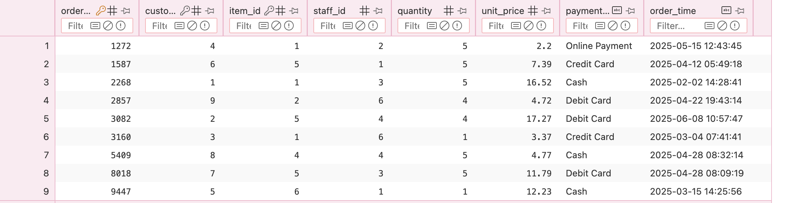

# SQL Reference Guide

## Table of Contents

1. [Overview](#overview)  
2. [Why This Project](#why-this-project)  
3. [SQLite Version Check](#sqlite-version-check)  
4. [Dataset Used](#dataset-used)   
5. [SQL Operations and Questions Covered](#sql-operations-and-questions-covered)  
6. [How to Run](#how-to-run)  
7. [Outputs](#output-snippets)
8. [Conclusion](#conclusion)  

---

## Overview

his project demonstrates key SQL concepts and advanced query techniques through a restaurant order management example.  
It serves as a **personalized SQL reference guide** for interview preparation and real-world data tasks.

You will find examples of:
- Table creation, insertion, and updates  
- Joins and aggregations  
- Data cleaning and transformation  
- Common Table Expressions (CTEs)  
- Window functions like `RANK()` and `LAG()`  
- Custom queries combining multiple SQL features  

---

## Why This Project

- To practice **SQL fundamentals** (DDL, DML, joins, aggregate functions).  
- To learn and document **advanced SQL features**: window functions, CTEs, data cleaning, string & date functions.  
- To create a **portfolio-ready SQL reference** for personal and professional use.  
- To analyze sample business data (restaurant orders) and answer realistic business questions.

---

## SQLite Version Check

To ensure compatibility, check your SQLite version in terminal:

```bash
sqlite3 --version
```
---

## Dataset used

A reference Kaggle restaurant dataset was reviewed (https://www.kaggle.com/datasets/haseebindata/restaurant-orders) for structure and logic inspiration.
However, the tables and data in this project were created manually using the reference as a guide.
This approach demonstrates how to design and populate relational databases independently while maintaining realistic data patterns.

---

## Database Schema

There are four tables in our restaurant database management system. 

The Orders table acts as the central link, establishing a one-to-many relationship with Customers, MenuItems, and Staff.

The Orders table is central, as it holds Foreign Keys (FKs) to the other three tables:

1. Orders.customer_id relates to Customers.customer_id (A customer places an order).

2. Orders.item_id relates to MenuItems.item_id (The order contains one menu item).

3. Orders.staff_id relates to Staff.staff_id (A staff member took the order).

---

## SQL Operations and Questions Covered

This section documents **all SQL operations** performed in the project — from setup to advanced analysis.  
Each entry explains the **operation**, **SQL command used**, **description**, and **real-world question answered**.

---

## 1. Database Setup Operations

| # | Operation | SQL Command(s) Used | Description | Business/Analytical Purpose |
|---|------------|--------------------|--------------|-----------------------------|
| 1 | Drop existing tables | `DROP TABLE IF EXISTS` | Removes existing tables safely to allow re-runs of the script. | Ensures a clean environment before recreating tables. |
| 2 | Create Customers table | `CREATE TABLE` | Creates the table to store customer information. | Tracks which customers place orders. |
| 3 | Create MenuItems table | `CREATE TABLE` | Creates table for food items and their categories. | Enables menu-based performance analysis. |
| 4 | Create Staff table | `CREATE TABLE` | Stores staff member details including hire dates. | Used for performance and HR-related queries. |
| 5 | Create Orders table with relationships | `CREATE TABLE ... FOREIGN KEY` | Defines relationships between Customers, MenuItems, and Staff. | Enables joins for order analytics and reporting. |

---

## 2. Data Insertion Operations

| # | Operation | SQL Command(s) Used | Description | Business/Analytical Purpose |
|---|------------|--------------------|--------------|-----------------------------|
| 6 | Insert customer data | `INSERT INTO` | Adds sample customers into the database. | Simulates real customer records for testing. |
| 7 | Insert menu items | `INSERT INTO` | Adds food items categorized as Starter, Main, or Dessert. | Enables menu-based analysis. |
| 8 | Insert staff records | `INSERT INTO` | Inserts staff members with roles and hire dates. | Enables HR performance evaluation. |
| 9 | Insert order data | `INSERT INTO` | Adds sample transactions connecting customers, staff, and menu items. | Simulates real-world restaurant operations. |

---

## 3. Data Maintenance and Validation

| # | Operation | SQL Command(s) Used | Description | Business/Analytical Purpose |
|---|------------|--------------------|--------------|-----------------------------|
| 10 | Update unit price | `UPDATE` | Modifies an existing order’s price. | Demonstrates data correction operations. |
| 11 | Confirm update | `SELECT ... WHERE` | Fetches updated order to validate changes. | Confirms accuracy of data modification. |

---

## 4. Basic Analytical Queries

| # | Operation | SQL Command(s) Used | Description | Business/Analytical Purpose |
|---|------------|--------------------|--------------|-----------------------------|
| 12 | Total orders & revenue | `COUNT()`, `SUM()` | Calculates number of orders and total revenue. | Measures business scale and income. |
| 13 | Average quantity & max order value | `AVG()`, `MAX()` | Computes average order size and highest order total. | Identifies order value patterns. |

---

## 5. Customer Insights

| # | Operation | SQL Command(s) Used | Description | Business/Analytical Purpose |
|---|------------|--------------------|--------------|-----------------------------|
| 14 | Total spent per customer | `JOIN`, `SUM()`, `GROUP BY` | Calculates total spend for each customer. | Identifies top customers and loyalty behavior. |
| 15 | Customer ranking by spend | `WITH`, `RANK()`, `ROW_NUMBER()` | Ranks customers based on total spending. | Useful for VIP customer segmentation. |
| 16 | Previous order comparison | `LAG()`, `OVER()` | Compares a customer’s current order total with the previous one. | Tracks changing spending trends. |
| 17 | Spending category segmentation | `CASE`, `UNION`, `COALESCE()` | Classifies customers into High or Low spenders. | Enables marketing segmentation and retention analysis. |

---

## 6. Menu Performance Analysis

| # | Operation | SQL Command(s) Used | Description | Business/Analytical Purpose |
|---|------------|--------------------|--------------|-----------------------------|
| 18 | Most popular item | `JOIN`, `SUM()`, `GROUP BY`, `ORDER BY`, `LIMIT` | Aggregates item quantities ordered. | Identifies best-selling dishes for menu decisions. |
| 19 | Item sales summary | `JOIN`, `SUM()` | Calculates total revenue per menu item. | Evaluates category or product performance. |

---

## 7. Payment Insights

| # | Operation | SQL Command(s) Used | Description | Business/Analytical Purpose |
|---|------------|--------------------|--------------|-----------------------------|
| 20 | Orders count by payment method | `GROUP BY`, `HAVING` | Counts total orders by payment type. | Determines popular payment options. |
| 21 | Normalize payment method text | `REPLACE()`, `LOWER()` | Cleans and standardizes payment method names. | Prepares data for consistent reporting. |

---

## 8. Time-Based Insights

| # | Operation | SQL Command(s) Used | Description | Business/Analytical Purpose |
|---|------------|--------------------|--------------|-----------------------------|
| 22 | Extract order month | `substr(order_time, 1, 7)` | Extracts year and month from order timestamp. | Enables month-wise sales trend analysis. |

---

## 9. Staff Performance and HR Metrics

| # | Operation | SQL Command(s) Used | Description | Business/Analytical Purpose |
|---|------------|--------------------|--------------|-----------------------------|
| 23 | Revenue generated per staff | `JOIN`, `SUM()`, `GROUP BY` | Calculates total sales generated by each staff. | Measures performance contribution. |
| 24 | Longest-serving staff | `ORDER BY hire_date ASC`, `LIMIT 1` | Retrieves staff member with earliest hire date. | Identifies senior employees and experience levels. |

---

## 10. Derived Metrics and Classifications

| # | Operation | SQL Command(s) Used | Description | Business/Analytical Purpose |
|---|------------|--------------------|--------------|-----------------------------|
| 25 | Classify order type | `CASE WHEN` | Categorizes orders as Small, Medium, or Bulk. | Helps assess order volume distribution. |
| 26 | Compute total per order | `quantity * unit_price` | Calculates the total cost per order. | Core metric for revenue analytics. |

---

## Types of Questions Answered

| Category | Example Question | SQL Concept Demonstrated |
|-----------|------------------|--------------------------|
| **Business Overview** | How many orders were placed and what is the total revenue? | Aggregation (`COUNT`, `SUM`) |
| **Customer Analytics** | Which customers spend the most? | `JOIN`, `GROUP BY`, Window functions |
| **Menu Optimization** | Which item is ordered the most? | Aggregation + Sorting |
| **Staff Productivity** | Which staff generated the most revenue? | `JOIN`, `GROUP BY` |
| **Payment Insights** | What are the most common payment methods? | `GROUP BY`, `HAVING` |
| **Order Trends** | What’s the average quantity and max order value? | `AVG()`, `MAX()` |
| **Behavioral Tracking** | How does customer spending change over time? | `LAG()` window function |
| **Segmentation** | Who are high vs. low spenders? | `CASE`, `UNION`, Conditional logic |
| **Operational Planning** | What portion of orders are bulk vs. small? | `CASE WHEN` |
| **Employee Analytics** | Who has served the longest? | Sorting + Filtering by date |

---

## SQL Concepts Practiced

| Category | SQL Feature |
|-----------|--------------|
| **Data Definition (DDL)** | `CREATE TABLE`, `DROP TABLE`, `PRIMARY KEY`, `FOREIGN KEY` |
| **Data Manipulation (DML)** | `INSERT`, `UPDATE` |
| **Data Retrieval (DQL)** | `SELECT`, `WHERE`, `JOIN`, `ORDER BY`, `GROUP BY` |
| **Aggregation** | `COUNT()`, `SUM()`, `AVG()`, `MAX()`, `MIN()` |
| **Window Functions** | `RANK()`, `ROW_NUMBER()`, `LAG()` |
| **CTEs (Common Table Expressions)** | `WITH ... AS` |
| **Conditional Logic** | `CASE WHEN`, `COALESCE()` |
| **String & Date Functions** | `REPLACE()`, `LOWER()`, `substr()` |
| **Filtering & Constraints** | `HAVING`, `LIMIT` |
| **Data Normalization** | Cleaning and text standardization |

---

## How to Run

1. Save all SQL statements to a file named `script.sql`.  
2. Open SQLite by running the following command in your terminal:

```bash
sqlite3 restro.db
```
3. Execute the SQL script inside SQLite:
```sql
.read script.sql
```
---

## Output Snippets

Following are the tables created- 

1. 

---

2. 

---

3. 

---

4. 

---

5. Code and outputs of the code- 


---

## Conclusion

1. This project demonstrates core and advanced SQL techniques in a realistic restaurant orders scenario.
2. It serves as a reference guide for interview preparation, SQL practice, and small-scale analytics projects.
3. Designed normalized tables with relationships
4. Practiced aggregate functions, joins, window functions, and CTEs
5. Performed data cleaning and transformation
6. Created a reusable SQL reference guide for future use